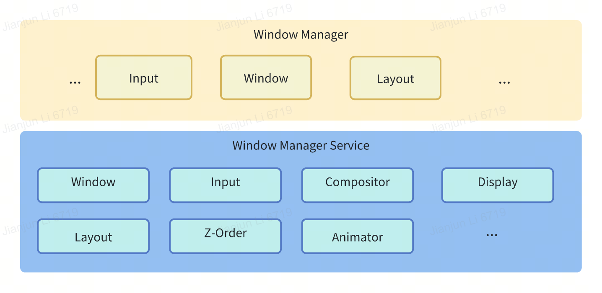

# Window Manager

[English|[简体中文](./README_zh-cn.md)]

## Introduction
Window Manager is one of the most important services in the openvela operating system, mainly responsible for input management, output management, and display management. Its main structure is shown in Figure 1.

**Figure 1** Window Manager Service Architecture

- **Window Manager**

    The window management client on the application side runs in the application's user space, responsible for window management and rendering within the application, and passes the rendered image to the server.
    
- **Window Manager Server**

    Server-side window management service, as a core capability of the system, runs in the kernel system service process, responsible for window management, scheduling, and composition between applications.

### Features
- Window attribute and style management: including adjustments of window position, size, opacity, etc.
- Window lifecycle management: including window creation, display, hiding, and deletion
- Event listener management
- Window transition animation management

## Directory
```
├── wm
│   ├── aidl
│   ├── app
│   ├── CMakeLists.txt
│   ├── common
│   ├── config
│   ├── images
│   ├── include
│   ├── Kconfig
│   ├── Make.defs
│   ├── Makefile
│   ├── README.md
│   ├── README_zh-cn.md
│   ├── server
│   └── test
```
## Constraints

- The .Kconfig file is used to configure compilation options for the window management service.
- Language version: C++11 or above
- Dependencies: OpenVela Core Service

## Instructions

The following are basic usage instructions for native application-side window management.

### Get the Window Manager Service

To get an instance of the window manager service, you can use the following code:

```c++
WindowManager windowManager = (WindowManager) getService(WindowManager::name());
```

### Create a Window

Use WindowManager.LayoutParams to create a window, as shown in the following code:

```c++
WindowManager.LayoutParams layoutParams = new WindowManager.LayoutParams();
layoutParams.type = WindowManager.LayoutParams.TYPE_APPLICATION;
layoutParams.format = PixelFormat.FORMAT_RGB_888;
layoutParams.width = WindowManager.LayoutParams.MATCH_PARENT;
layoutParams.height = WindowManager.LayoutParams.MATCH_PARENT;
layoutParams.x = 0;
layoutParams.y = 0;
layoutParams.windowTransitionState = WindowManager.LayoutParams.WINDOW_TRANSITION_ENABLE;

BaseWindow window = new BaseWindow(context, this);
windowManager.addWindow(window, layoutParams, visibility);
```

The above code creates a window for the application and adds it to the window list managed by the window manager service.

### Modify Window Attributes

To modify the attributes of a window, use the following code:

```c++
WindowManager.LayoutParams layoutParams = getWindow().getLayoutParams();
layoutParams.x = 200;
layoutParams.y = 200;
getWindow().setLayoutParams(layoutParams);
```

The above code changes the position of the current activity's window to (200, 200).

### Remove a Window

To remove a window, use the following code:

```c++
windowManager.removeWindow(window);
```